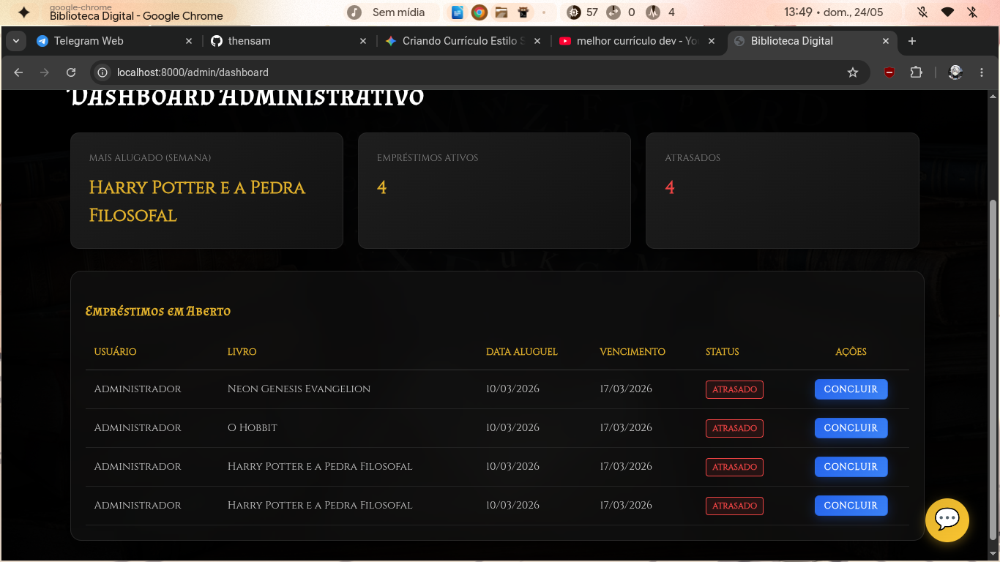
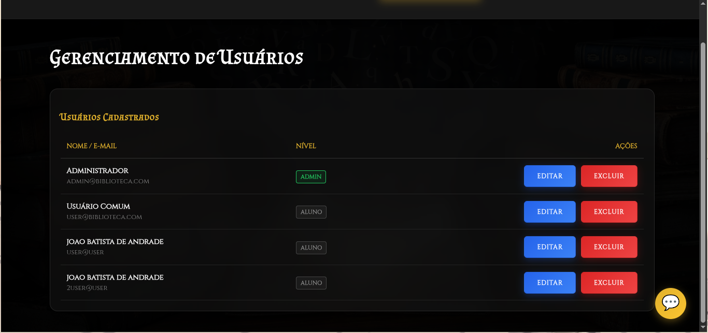

### Catálogo de Livros
Aqui os usuários podem visualizar a disponibilidade dos títulos em tempo real.

---

### Painel Administrativo

Aqui é feita a gestão centralizada dos empréstimos ativos e atrasados.

---

### Gerenciamento de Usuários

Nesta tela, o administrador controla os níveis de acesso (`Admin` / `Aluno`).

